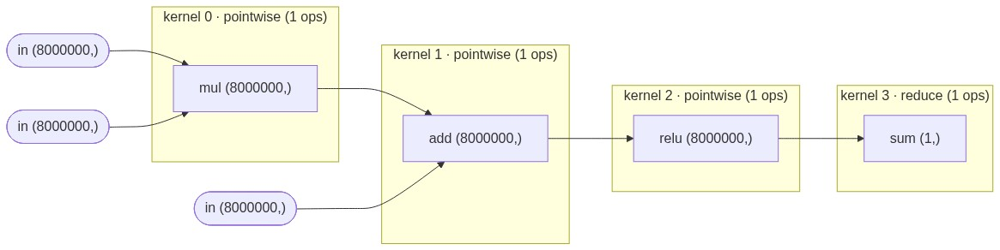
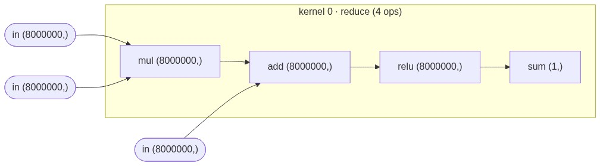

# tinytorchcompile

`torch.compile` in a nutshell, showing its main idea: **operator fusion**. It traces a lazy tensor expression and fuses a whole chain of ops into a single C loop creating one kernel and no intermediate arrays. ***Operator fusion removes the memory transfers between RAM and the processor thereby speeding up the memory-bound operations like activation functions, layer normalization, softmax, etc.*** Play with it in the attached [demo notebook](demo.ipynb).


## Why is operator fusion the heart of `torch.compile`?

In the attached [demo notebook](demo.ipynb), the same expression is run and timedin four different ways:
- torch eager: 11.7 ms (4 kernels) --> runs the expression in eager mode (running each python line sequentially) without any compilation.
- torch.compile: 1.9 ms (1 kernel) --> compiles the expression into a highly optimized single C++ loop and runs it.
- tinytorchcompile unfused: 29.9 ms (4 kernels) --> compiled into C code but NOT fused into one loop. It has 4 loops transfering the intermediate arrays between RAM and processor. This is even slower than eager mode as shown in the PyTorch 2 paper.
- tinytorchcompile fused: 7.8 ms (1 kernel) --> compiled into C code and fused into one nested loop, removing intermediate arrays and transfering them between RAM and processor.

This shows that without operator fusion, compiling is no faster than eager because it has the same memory transfers but without the optimized numpy operations. Operator fusion removes the memory transfers of intermediate arrays from RAM to processor (like on GPU's HBM to SRAM) making the runtime no longer memory-bound. It alone led to a 3.8x (tinytorchcompile fused vs tinytorchcompile unfused) speedup. On top of this, other optimizations in `torch.compile` like multithreading and SIMD instructions work only because the memory bottleneck is removed by operator fusion. In above example, they led to an additional 2.3x speedup (torch.compile is 11.7ms/1.9ms = 6.1x faster than torch eager, 3.8x is due to operator fusion and 2.3x is due to other optimizations). To understand it theoretically, suppose that half of the total runtime is taken by memory transfers and other half is taken in computation like matrix multiplications, and operator fusion completely removes the time in memory transfer. This gives a speedup of 2x. Moreover, an optimization like multithreading on 10 threads would speed up the computation by 10x. Without operator fusion, it would only give a speedup of 5x because half of the time is taken by memory transfers. But with operator fusion, multithreading speeds up the total time by 10x. Hence, operator fusion speeds up each other optimization as well. If you understand this, you have a working understanding of `torch.compile`. Otherwise check out the PyTorch 2 paper or the [demo notebook](demo.ipynb).

Unfused, each of the 4 ops is its own kernel writing a full intermediate array back to RAM:



tinytorchcompile fuses those 4 ops into 1 kernel, so memory transfer of intermediate arrays is removed:



`torch.compile` fuses the same chain into one kernel too:


Note: The above times are measured on CPU of Macbook M1 Pro and for a single function call. The actual runtime will be faster on a GPU or if the function is called multiple times due to caching. If you want to see the difference in runtime on a GPU, you can run the [demo notebook](demo.ipynb) on a GPU.

## Run it

```python
import numpy as np, tinytorchcompile as ttc

@ttc.compile                      # works just like torch.compile
def f(w, x, b):
    return (w * x + b).relu().sum()

w, x, b = (np.random.randn(1_000_000) for _ in range(3))
print(f(w, x, b))      # the fused, compiled result
print(f.num_kernels)   # 1, the four ops fused into one loop
print(f.csrc)          # the C code generated, compiled, and ran
```

The four ops (`mul, add, relu, sum`) become **one** loop with no intermediate arrays:

```c
static void kernel_b6(double* in0, double* in1, double* in2, double* out) {
  double acc=0.0; for(long k=0;k<1000000;k++){ acc = acc + (fmax(((in0[k] * in1[k]) + in2[k]), 0.0)); } out[0]=acc;
}
```

To run the demo notebook, you can use the following commands:
```bash
pip install numpy                      # torch optional, for comparison with torch.compile
python tinytorchcompile.py                 # the algorithm of operator fusion in a single file
jupyter lab demo.ipynb    # the demo notebook
```

## How tinytorchcompile works

The pipeline of tinytorchcompile is similar to TorchInductor: **trace -> lower -> fuse -> codegen -> run**.

1. **Trace.** Operator overloading on `Tensor` records a lazy graph of ops.
2. **Lower.** Each node becomes a `Buffer` whose loop body is a closure `inner(index)` calling a *virtualized* ops namespace `V.ops`. Swap the handler and the same body changes job: `Analysis` records reads, `Codegen` emits C — TorchInductor's central trick.
3. **Fuse.** Just closure inlining: the scheduler marks pointwise producers `inlined`, so a consumer recomputes them in place instead of reading a materialized array.
4. **Codegen + run.** One C kernel per materialized buffer, compiled with `clang`/`gcc`, called via `ctypes`.

Attached [demo notebook](demo.ipynb) demonstrates the above pipeline of operator fusion with a simple example and a complex example:

- Operator fusion on `(w * x + b).relu().sum()` — ~8ms in fused vs ~30ms in unfused kernels for linear+relu operation on an 8M sized input vector demonstrating a 3.75x speedup. Prints the highly optimized C++ code of this fused kernel used in torch.compile.
- ResNet layer via `torch.compile` — times in eager(unfused) vs compiled(fused), prints the highly optimized C++ code of this fused kernel generated by TorchInductor under the hood of torch.compile. TorchInductor fuses the conv-bn-relu epilogues into a handful of kernels:


## Reference

PyTorch 2 paper: *"PyTorch 2: Faster Machine Learning Through Dynamic Python Bytecode Transformation and Graph Compilation"* (Ansel et al., ASPLOS 2024) — its ablation shows fusion is what makes compilation beat eager.

## Contributing

If you found this repo useful, consider giving it a ⭐ as it helps others discover it. Also, if you have any suggestions or feedback, please feel free to open an issue or a pull request.